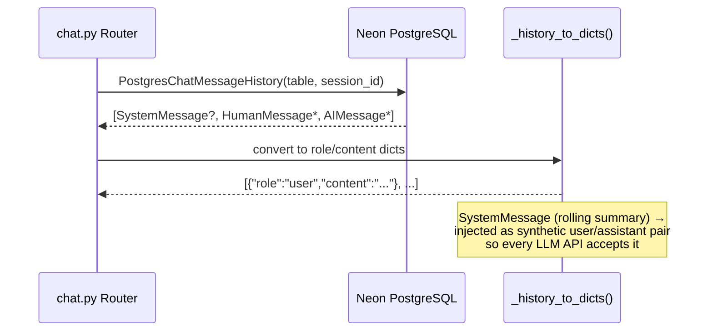
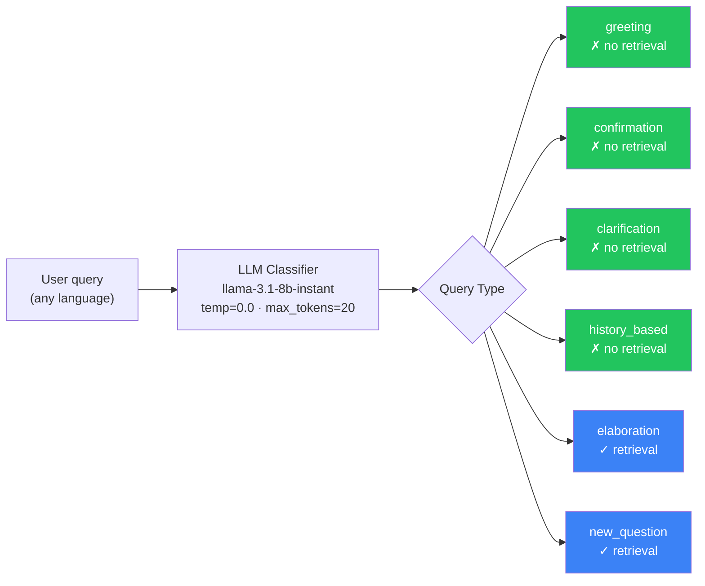
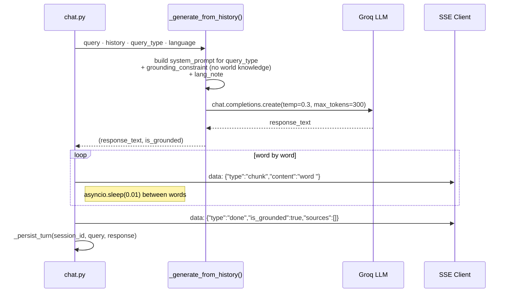
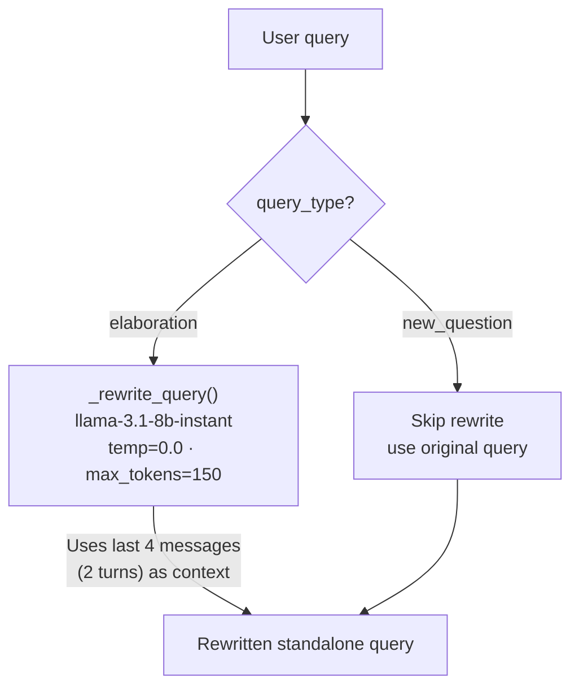
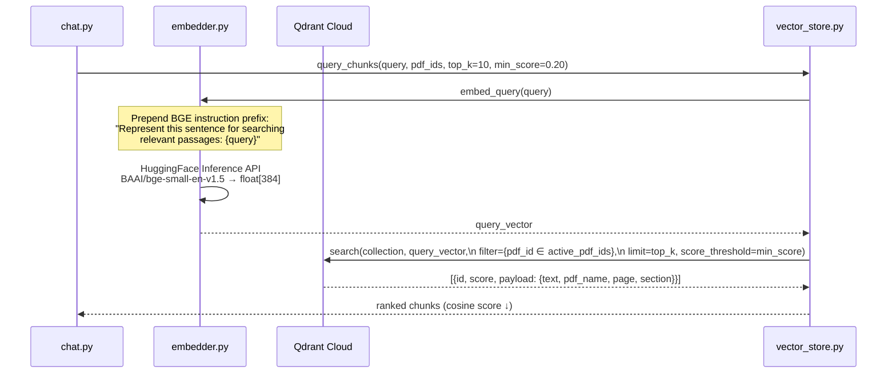
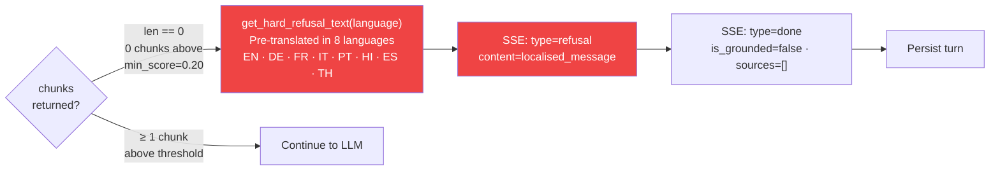
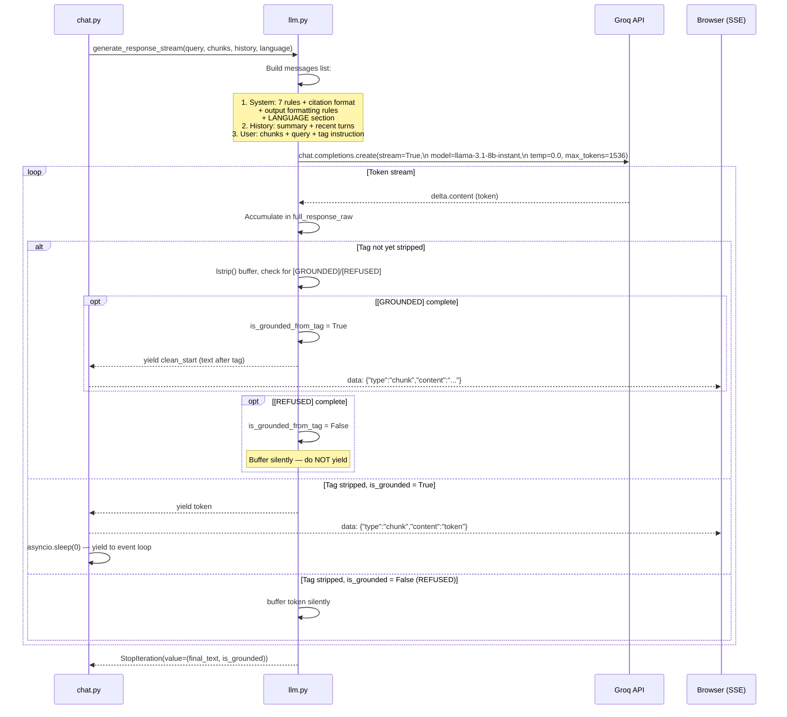
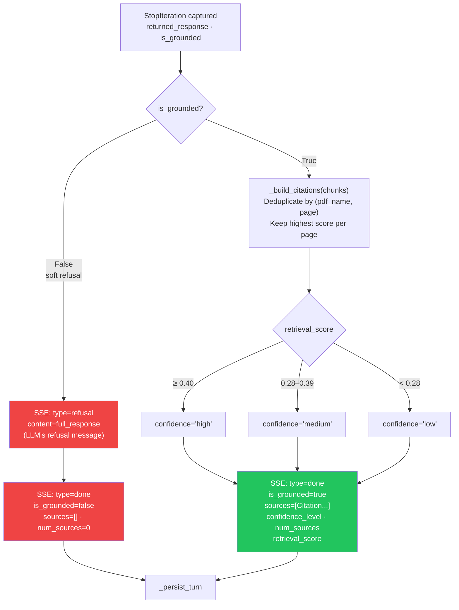

# RAG Chat Query Pipeline — Detailed Architecture

> **System:** DocMind PDF Conversational Agent  
> **Endpoint:** `POST /api/chat/stream`  
> **Protocol:** Server-Sent Events (SSE) — tokens streamed token-by-token  
> **Model:** Groq `llama-3.1-8b-instant`  
> **Embeddings:** HuggingFace Inference API — `BAAI/bge-small-en-v1.5`

---

## 1. High-Level Pipeline Overview

```mermaid
flowchart TD
    A([👤 User Message]) --> B[POST /api/chat/stream\nwith session_id · active_pdf_ids · response_language]
    B --> C[Load Conversation History\nfrom Neon PostgreSQL]
    C --> D{Query Classification\n_is_retrieval_required}

    D -- "greeting / confirmation\nclarification / history_based" --> E[Branch A\n_generate_from_history]
    D -- "new_question / elaboration" --> F[Branch B\nRAG Retrieval Pipeline]

    E --> E1[Stream word-by-word\nwith grounding constraint]
    E1 --> E2[SSE: type=chunk events]
    E2 --> E3[SSE: type=done\nis_grounded · sources=[]]
    E3 --> Z[Persist Turn → Neon]

    F --> F1[Query Rewriting\n_rewrite_query]
    F1 --> F2[Semantic Retrieval\nquery_chunks]
    F2 --> F3{Hard Refusal Gate\nchunks found?}
    F3 -- "0 chunks above\nmin_score=0.20" --> F4[SSE: type=refusal\nLocalised message]
    F3 -- "chunks retrieved" --> F5[LLM Generation\ngenerate_response_stream]
    F5 --> F6{Tag Detection\n[GROUNDED] or [REFUSED]?}
    F6 -- "[GROUNDED]" --> F7[Stream chunks\nSSE: type=chunk]
    F6 -- "[REFUSED]" --> F8[Buffer silently\nSSE: type=refusal]
    F7 --> F9[SSE: type=done\ncitations · confidence · score]
    F8 --> F9
    F4 --> Z
    F9 --> Z

    style A fill:#6c63ff,color:#fff
    style Z fill:#22c55e,color:#fff
    style F4 fill:#ef4444,color:#fff
    style F8 fill:#ef4444,color:#fff
    style D fill:#f59e0b,color:#fff
    style F3 fill:#f59e0b,color:#fff
    style F6 fill:#f59e0b,color:#fff
```

---

## 2. Step-by-Step Breakdown

### Step 0 — Request Ingestion

```
POST /api/chat/stream
{
  "message":           "What is the notice period for SB4?",
  "session_id":        "550e8400-e29b-41d4-a716-446655440000",
  "active_pdf_ids":    ["pdf_abc123"],
  "response_language": "en"          ← BCP-47 code; "auto" = match user's language
}
```

**Validation gates (before any ML work):**

| Check | Limit | Error |
|---|---|---|
| `active_pdf_ids` must be non-empty | — | HTTP 400 |
| `message` must be non-empty | — | HTTP 400 |
| `message` length | ≤ 2 000 chars | HTTP 400 |

---

### Step 1 — Load Conversation History



**History schema after conversion:**
```python
[
  # Optional rolling summary (compressed older turns)
  {"role": "user",      "content": "[Summary of our earlier conversation]\n..."},
  {"role": "assistant", "content": "Understood. I have the full context..."},

  # Recent verbatim turns (max 5 exchanges)
  {"role": "user",      "content": "What is the L&D budget?"},
  {"role": "assistant", "content": "The annual L&D budget is $2,000 [Page 13 — handbook.pdf]"},
]
```

> **Rolling summarisation** (`_maybe_summarize`) fires every 5 complete exchanges: the oldest messages are collapsed into a `SystemMessage` in Neon to keep the token footprint bounded.

---

### Step 2 — Query Classification



**Classifier safety rules (added to prompt):**
- Any **factual question** (colour, number, name, definition) NOT in history → `new_question`
- Non-English / Hinglish queries → `new_question` unless clearly referencing prior history
- Unrecognised output → default `new_question` (over-retrieve, never hallucinate)
- Output parsed as `.split()[0]` — only first word taken to guard against multi-word responses

**Special case — no history (first message):**  
Pattern-matched against a list of English greeting keywords (`hello`, `hi`, `thank you`, …). Anything else → `new_question` immediately, no LLM call.

---

### Branch A — History-Based Response



**Grounding constraint (appended to every branch):**
> *"Do NOT use general world knowledge. If the user's question asks for factual information NOT present in the conversation history, respond ONLY with: 'I can only answer questions based on the uploaded PDF documents.'"*

---

### Branch B — RAG Retrieval Pipeline

#### B1 — Query Rewriting



**Examples:**

| Original | Rewritten |
|---|---|
| `"Tell me more"` | `"Tell me more about the L&D budget and what it covers"` |
| `"What about SB5?"` | `"What is the notice period for an SB5 role?"` |
| `"What is the health policy?"` | *(unchanged — new topic)* |

> The rewriter is **skipped entirely for `new_question`** — unrelated queries must not be polluted with prior context.

---

#### B2 — Semantic Retrieval



**Chunk payload structure:**
```python
{
  "text":     "13.2 Involuntary Termination\nIn cases of termination without cause...",
  "score":    0.743,
  "metadata": {
    "pdf_id":       "pdf_abc123",
    "pdf_name":     "TechNova_Employee_Handbook.pdf",
    "page_number":  17,
    "chunk_index":  3,
    "section":      "13. Separation from Employment"
  }
}
```

---

#### B3 — Hard Refusal Gate



> This gate fires **before the LLM is ever called** — eliminating hallucination on out-of-scope queries entirely.

---

#### B4 — LLM Generation & Streaming



---

#### B5 — Post-Stream: Refusal vs Grounded Path



---

## 3. SSE Event Reference

The browser receives a stream of `text/event-stream` events:

| `type` | When | Key Fields |
|---|---|---|
| `metadata` | After retrieval, before LLM | `retrieval_score` |
| `chunk` | Each streamed token | `content` |
| `refusal` | Hard or soft refusal | `content` (localised message) |
| `done` | Stream complete | `is_grounded`, `sources`, `confidence_level`, `num_sources`, `retrieval_score` |
| `error` | Exception in pipeline | `message` |

**Example stream (grounded answer):**
```
data: {"type":"metadata","retrieval_score":0.743}

data: {"type":"chunk","content":"The notice period for an SB4 role is "}
data: {"type":"chunk","content":"**4 weeks**"}
data: {"type":"chunk","content":" [Page 17 — TechNova_Employee_Handbook.pdf]."}

data: {"type":"done","is_grounded":true,"sources":[{"pdf_name":"TechNova_Employee_Handbook.pdf","page_number":17,"section":"13. Separation from Employment","score":0.743}],"confidence_level":"high","num_sources":1,"retrieval_score":0.743}
```

**Example stream (hard refusal — French):**
```
data: {"type":"refusal","content":"Je suis désolé, mais cette question ne semble pas être couverte par le(s) PDF téléchargé(s)..."}

data: {"type":"done","is_grounded":false,"sources":[],"confidence_level":null,"num_sources":0}
```

---

## 4. Anti-Hallucination Defense Layers

```mermaid
flowchart LR
    Q([Query]) --> L0

    subgraph L0["Layer 0 — Index Time"]
        direction TB
        I1[Contextual header\ninjected into every chunk]
        I2[Semantic boundaries\npreserve meaning]
        I3[Cross-page overlap\nprevents split paragraphs]
    end

    L0 --> L1

    subgraph L1["Layer 1 — Classification"]
        direction TB
        C1[Factual queries forced\nto retrieval path]
        C2[Non-English queries\ndefault to new_question]
        C3[Grounding constraint\nin history branch]
    end

    L1 --> L2

    subgraph L2["Layer 2 — Retrieval Gate"]
        direction TB
        R1[cosine min_score=0.20\nhard threshold]
        R2[0 chunks → deterministic\nrefusal without LLM call]
        R3[Localised refusal\nin user's language]
    end

    L2 --> L3

    subgraph L3["Layer 3 — Generation"]
        direction TB
        G1[7 explicit grounding rules\nin system prompt]
        G2["[GROUNDED]/[REFUSED]\nstructural tag protocol"]
        G3[Soft refusal detection\nvia tag — not regex]
    end

    L3 --> A([Answer or Refusal])

    style L0 fill:#1e3a5f,color:#fff
    style L1 fill:#1e3a5f,color:#fff
    style L2 fill:#7f1d1d,color:#fff
    style L3 fill:#14532d,color:#fff
```



---

## 5. Token Budget at Each Stage

| Stage | Model | `max_tokens` | `temperature` | Purpose |
|---|---|---|---|---|
| Query classification | `llama-3.1-8b-instant` | 20 | 0.0 | One-word output |
| Query rewriting | `llama-3.1-8b-instant` | 150 | 0.0 | Standalone query |
| History response | `llama-3.1-8b-instant` | 300 | 0.3 | Short, warm reply |
| RAG answer (stream) | `llama-3.1-8b-instant` | 1 536 | 0.0 | Full grounded answer |
| Rolling summary | `llama-3.1-8b-instant` | 1 024 | 0.0 | Compress old turns |
| Summary compression | `llama-3.1-8b-instant` | 512 | 0.0 | Re-compress if >800 tok |

> **Groq free tier limit:** 6 000 TPM. The flat semantic chunking strategy (threshold=88, top_k=10) was specifically chosen to keep the total prompt well under this limit.

---

## 6. Full Pipeline Sequence (Happy Path)

```mermaid
sequenceDiagram
    actor U as User
    participant FE as Next.js Frontend
    participant API as FastAPI /chat/stream
    participant DB as Neon PostgreSQL
    participant CLS as Classifier LLM
    participant RW as Rewriter LLM
    participant QD as Qdrant Cloud
    participant HF as HuggingFace API
    participant GR as Groq LLM (streamed)

    U->>FE: Types message
    FE->>API: POST /api/chat/stream (SSE request)
    API->>DB: Load session history
    DB-->>API: [summary?, recent turns]
    API->>CLS: Classify query type
    CLS-->>API: "new_question"
    API->>RW: Rewrite query (if elaboration; else skip)
    RW-->>API: standalone_query
    API->>HF: Embed standalone_query (BGE + prefix)
    HF-->>API: float[384] query vector
    API->>QD: Cosine search (top_k=10, min_score=0.20)
    QD-->>API: ranked chunks
    API-->>FE: data: {"type":"metadata","retrieval_score":0.74}
    API->>GR: Stream: system + history + chunks + query
    loop Streaming tokens
        GR-->>API: token delta
        API-->>FE: data: {"type":"chunk","content":"token"}
    end
    GR-->>API: StopIteration(final_text, is_grounded=True)
    API-->>FE: data: {"type":"done","sources":[...],"confidence":"high"}
    API->>DB: Persist turn (user + assistant)
    API->>DB: Maybe summarise (every 5 turns)
```
